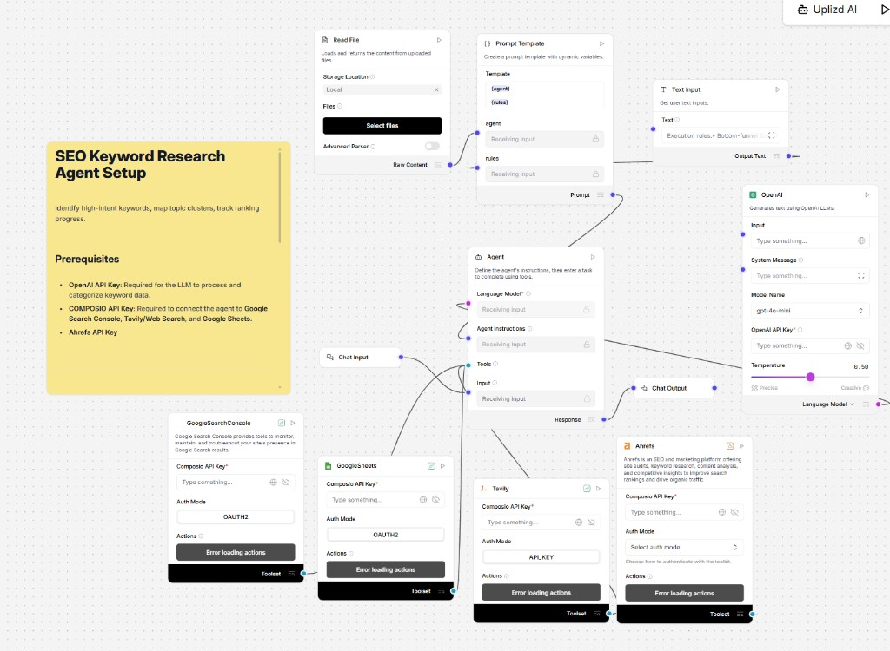

# SEO Keyword Researcher Agent

> Open-source web UI for the **SEO Keyword Researcher Agent** — powered by [UPLIZD](https://uplizd.ai). The hosted flow identifies high-intent keywords, maps topic clusters, and tracks ranking progress using **gpt-4o-mini** (temperature **0.50**), a prompt built from **Read File** + **Text Input** rules (`{agent}` / `{rules}`), and integrations for **Google Search Console**, **Google Sheets**, **Tavily**, and **Ahrefs**.

[](https://uplizd.ai/marketplace/seo-keyword-researcher-agent)



---

## How it works

This repo is **only the playground UI + Express proxy**. Credentials attach to the **UPLIZD** flow (OpenAI, Composio, Ahrefs)—not baked into this app.

```
Browser  →  React UI  →  POST /api/run (proxy)  →  UPLIZD API  →  SEO Keyword Researcher flow
```

---

## Workflow logic (matches the Langflow canvas)

| Piece | Role |
|-------|------|
| **Read File** | Loads context from local storage → feeds **Prompt Template** |
| **Text Input** | Execution rules (e.g. bottom-funnel priority) → **Prompt Template** |
| **Prompt Template** | Builds `{agent}` + `{rules}` → **Agent Instructions** |
| **Chat Input** | User requests → **Agent** input |
| **OpenAI** | **gpt-4o-mini**, temperature **0.50** → language model for Agent |
| **Google Search Console** (Composio) | Queries / property performance (OAuth2) |
| **Google Sheets** (Composio) | Logging keyword tables (OAuth2) |
| **Tavily** | Web research (API key auth in template) |
| **Ahrefs** | Keyword / competitor metrics (API per your node config) |
| **Chat Output** | Final answer to the user |

**Prerequisites (in the flow):** OpenAI API key, Composio API key, Ahrefs API key; complete OAuth for GSC and Sheets.

---

## Features

- Chat playground aligned with **Chat Input / Chat Output**
- **Secure proxy** — `UPLIZD_API_KEY` stays server-side
- **Quick prompts** for GSC + Ahrefs + Sheets workflows
- **Dark mode** — system preference
- **Session ID** — “New session” rotates `session_id`

---

## Extension ideas

Ideas that stay compatible with this playground (**React UI + Express proxy**; all tool wiring remains in UPLIZD):

- **Intent ladder** — In the flow, encode `{rules}` so outputs separate informational vs. commercial vs. transactional clusters with suggested page types (pillar, supporting, landing).
- **GSC → Sheets loop** — Define a naming convention in Google Sheets for monthly snapshots (query, clicks, position) so the agent can compare periods without changing the UI.
- **Cannibalization checks** — Prompt rules that ask the model to flag URLs competing for the same primary query before finalizing a cluster map.
- **SERP feature hints** — Use Tavily / Ahrefs outputs in the agent instructions to prefer keywords where you can win snippets or avoid overcrowded SERPs.

---

## Stack

| Layer | Tech |
|-------|------|
| Frontend | React 18 + Vite |
| Proxy | Express (Node.js) |
| Workflow | UPLIZD Marketplace |

---

## Prerequisites

- Node.js ≥ 18
- UPLIZD account + API key
- Marketplace flow installed when published (or import template)

---

## Quick start

### 1 — Install the flow

**[→ SEO Keyword Researcher Agent on UPLIZD Marketplace](https://uplizd.ai/marketplace/seo-keyword-researcher-agent)**

1. Install and open the flow.
2. Copy **Flow ID** from the URL.
3. **Settings → API Keys** — your UPLIZD key.
4. In-editor: wire **Read File**, **Text Input**, **Prompt Template**, **OpenAI** (gpt-4o-mini, 0.50), and Composio toolkits (GSC, Sheets, Tavily); add **Ahrefs** with valid API/auth.

### 2 — Configure this repo

```bash
git clone https://github.com/YOUR_ORG/seo-keyword-researcher-agent.git
cd seo-keyword-researcher-agent
cp .env.example .env
```

```bash
UPLIZD_API_KEY=your_api_key_here
UPLIZD_FLOW_ID=your_flow_id_here
```

### 3 — Run

```bash
npm run install:all
npm run dev
```

**http://localhost:5173**

---

## Environment variables

| Variable | Required | Description |
|----------|----------|-------------|
| `UPLIZD_API_KEY` | ✅ | UPLIZD API key |
| `UPLIZD_FLOW_ID` | ✅ | Flow ID |
| `UPLIZD_BASE_URL` | — | Default `https://studio.uplizd.ai` |
| `PORT` | — | Proxy (default `3001`) |
| `CORS_ORIGIN` | — | Default `http://localhost:5173` |

---

## Project structure

```
seo-keyword-researcher-agent/
├── .env.example
├── .gitattributes
├── server/index.js
├── web/
└── docs/
    ├── workflow.png
    ├── setup.md
    └── contributing.md
```

---

## Contributing

See [docs/contributing.md](docs/contributing.md).

---

## License

MIT — see [LICENSE](LICENSE).
